## Benchmarks charts/V080

Benchmarks were made using Jmh version 1.35 and JDK 17.0.2 Java HotSpot(TM) on a Ryzen 9 7900 and the following libraries:
- Primitive Collections 0.8.0
- FastUtil 8.5.12
- HPPC 0.9.1
- Eclipse Collections 11.1.0

Each benchmark was created using Average Time with a 1 second warmup time and 10 iterations with 1 second test time* and using Primitive Values (objects for Java Collections)    
Score is the amount of time it took to do each operation in Microseconds (according to Jmh)    
The Variable Size defines the amount of elements the Collection had to deal with.    
These are used in 2 ways.    
- If the function is a "add/put" it is the amount of elements that are added into the empty collection.
- If the function is not a "add/put" its the amount of elements that are inside of the Collection and a 100 random elements (within range) are tested against.

Another definition is "addEmptyCollection". The Empty stands for the Collection was initialized without a expected size.    
While the "addCollection" is prepared with how many elements are about to be inserted.    
KeySets/Values are forEach Iterators    

1* It takes 3-4 hours to test everything so short tests for now until i can't wait like 8-16 hours with slower Benchmarks    
   
The results may differ for each JVM.    
More detailed results with Exact Numbers can be found [[here]](BENCHMARKS.md)

### Chart Infos
The X Axis is the amount elements added/inside the collection while the operation is performed.   
The Y Axis is the amount of time to process each action. In Microseconds. (Lower is better)

Lists

## Add

## AddEmpty

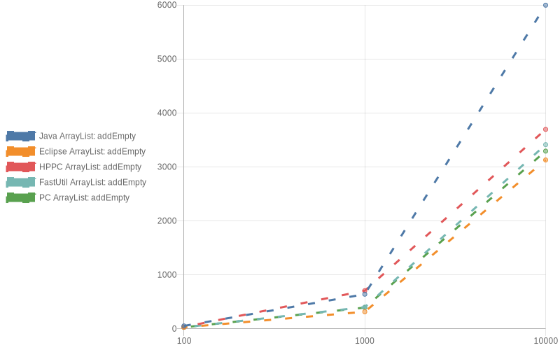

## For Loop

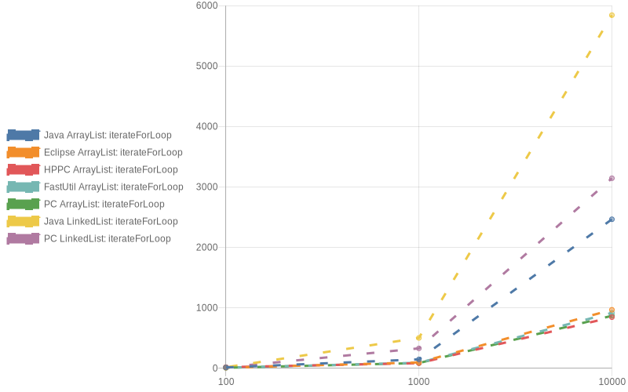

## Remove

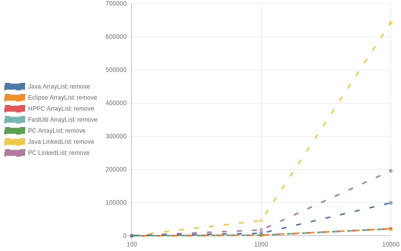

## To Array

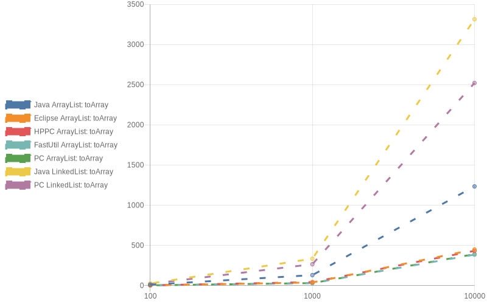

HashSets

## Add

## AddEmpty

## Contains

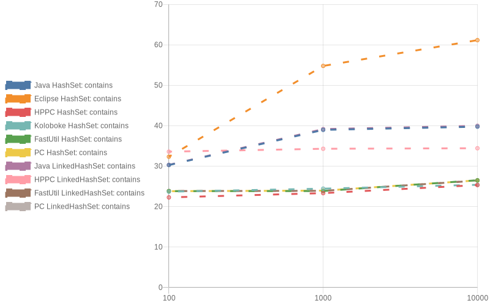

## For Loop

## Remove

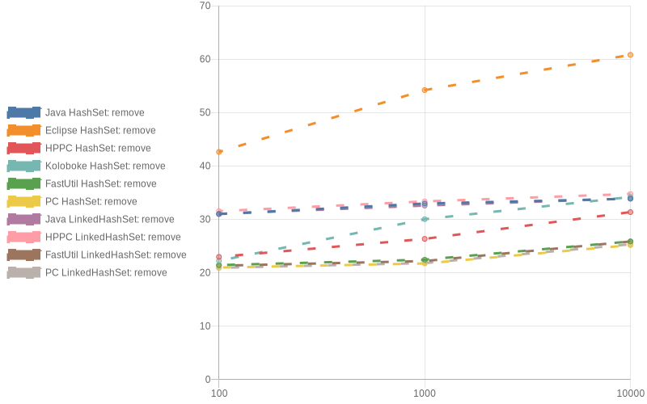

## To Array

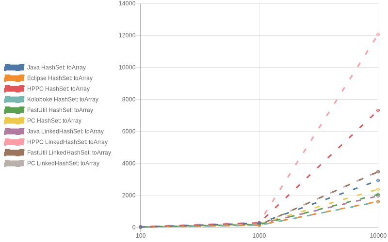

TreeSets

## Add

## Contains

## For Loop

## Remove

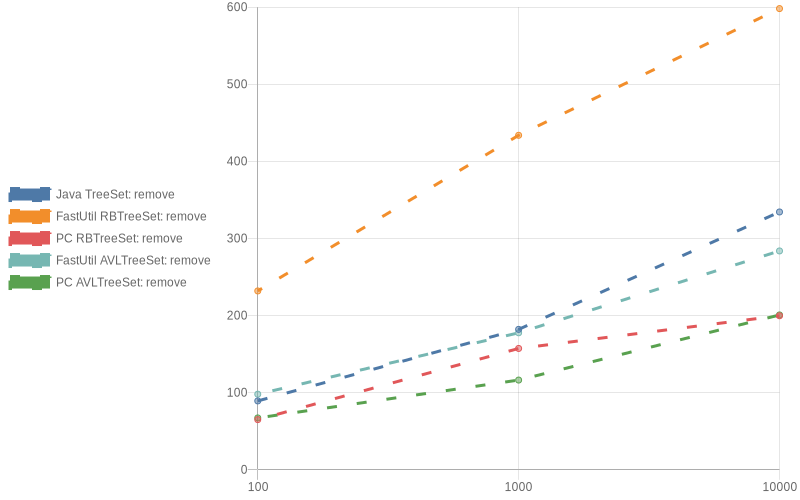

## To Array

HashMaps

## Put

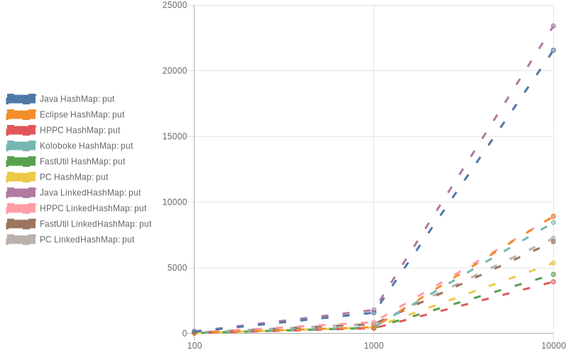

## PutEmpty

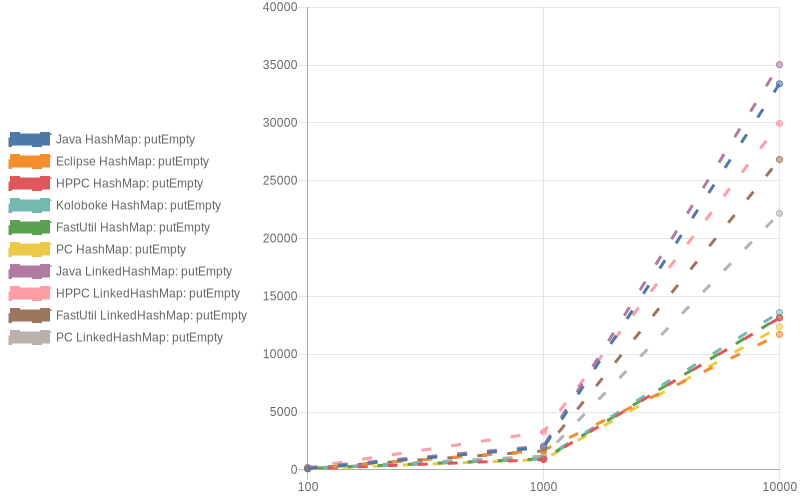

## Contains Key

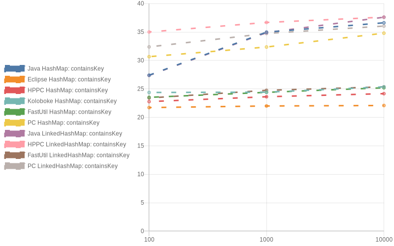

## For Each

## Clone

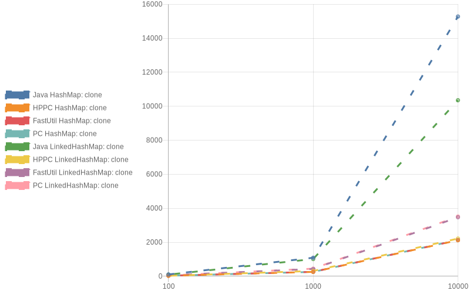

## Get

## Get Or Default

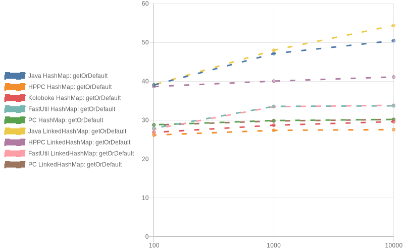

## Remove

TreeMaps

## Put

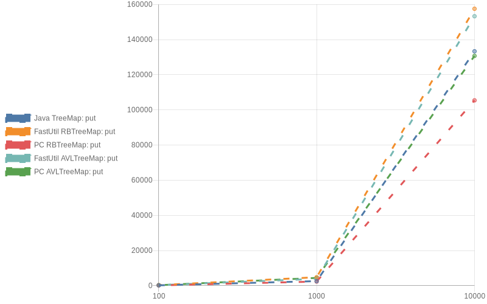

## Contains Key

## For Each

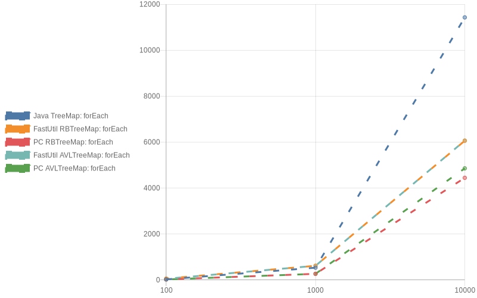

## Clone

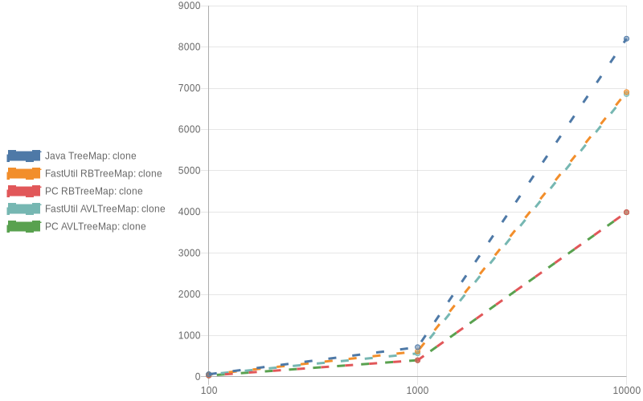

## Get

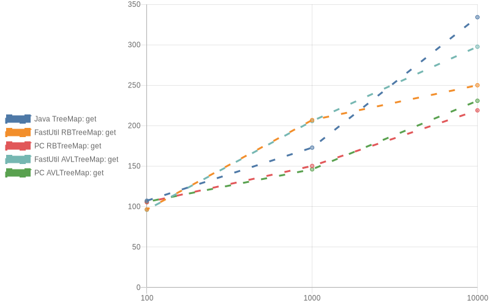

## Get Or Default

## Remove

