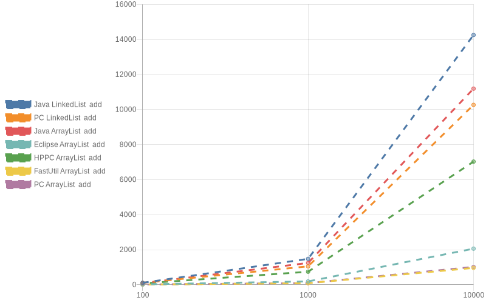

## Benchmarks Charts

Benchmarks were made using Jmh version 1.25 and Java OpenJDK 8 version 275-1 on a Intel I5-7500 and the following libraries:
- Primitive Collections 0.5.3
- FastUtil 8.5.6
- HPPC 0.9.1
- Eclipse Collections 11.0.0
   
The results may differ for each JVM.    
More detailed results with Exact Numbers can be found [[here]](BENCHMARKS.md)

Lists

## Add

## AddEmpty

## For Loop

## Remove

## To Array

HashSets

## Add

## AddEmpty

## Contains

## For Loop

## Remove

## To Array

TreeSets

## Add

## Contains

## For Loop

## Remove

## To Array

HashMaps

## Put

## PutEmpty

## Contains Key

## For Each

## Clone

## Get

## Get Or Default

## Remove

TreeMaps

## Put

## Contains Key

## For Each

## Clone

## Get

## Get Or Default

## Remove

